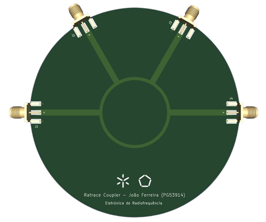
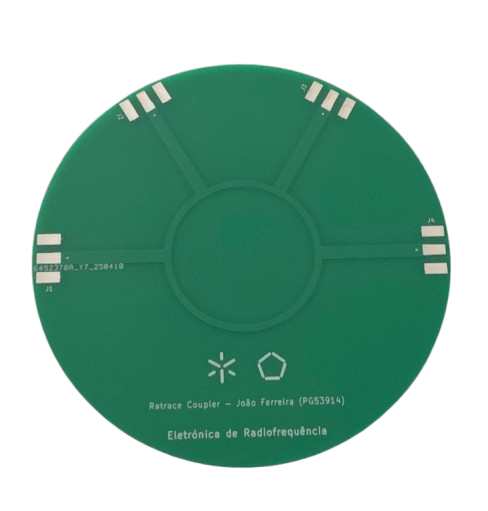

# 📡 Rat-Race Coupler Design @ 2.4 GHz

This repository presents the full development process of a **Rat-Race hybrid coupler** designed to operate at a **2.4 GHz** center frequency. The project focuses on applications in RF systems such as modulators, mixers, and wireless communication circuits.

  
  &nbsp;&nbsp;
  

## 🧠 Project Objective

The goal of this project is to explore the design, simulation, and manufacturing of a Rat-Race coupler by:

- Splitting signals with a 180° phase shift and equal amplitude (3 dB split).
- Combining signals with preserved phase and power balance.
- Applying microstrip line theory and transmission line calculations.

## 🧰 Tools Used

- **MATLAB**: For simulating S-parameters and signal phase behavior.
- **KiCAD**: For PCB layout and physical design.

## 📈 Technical Highlights

- **Signal injected at Port 1**: Analysis of output at Ports 2 and 4, with Port 3 acting as the isolated port.
- **Performance comparison (real vs simulated)**:
  - S21 and S41 measured around -4.8 dB (simulated: -4 dB).
  - S11 showed increased reflection in real test (~ -3 dB vs -17 dB simulated).
- **Impedance matching**:
  - Outer lines: 50 Ω (≈ 3 mm width)
  - Upper line: 70.7 Ω (≈ 1.6 mm width)
    
## 🧾 Full Documentation

To learn more about the theory, simulations, physical implementation and analysis results:
👉 [📄 Open the full report](./TP_ERF_PG53914_rat_race_coupler.pdf)
